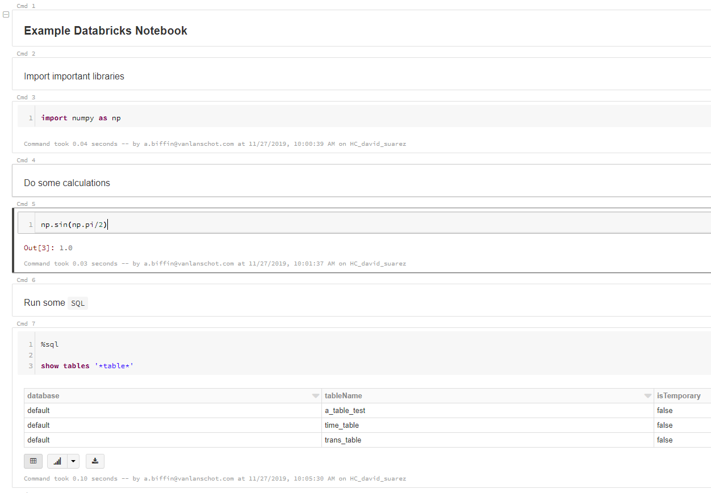

# ipynb-py-convert-databricks

Function for un- and re- doing the conversion from .ipynb ipython notebook to .py python file or .sql file which Databricks performs every time it exports a notebook. Building on code from [kiwi0fruit/ipynb-py-convert](https://github.com/kiwi0fruit/ipynb-py-convert)

## Why?

Databricks exports `.ipynb` files (e.g. when version controlling) as `.py` or `.sql`, which is pretty handy as it's easier to deal with a straight up python script file than a JSON formatted IPython notebook. However, it would be nice to perform the reverse operation, e.g. when we download a databricks notebook and want to run it in a local anaconda notebook.

## How?

Different conversions are possible:

* from the `.py` version made by Databricks to an IPython notebook:

`convert_databricks_nb('databricks_nb.py', 'databricks_nb.ipynb')`

* from the `sql` version made by Databricks to an IPython notebook:

`convert_databricks_nb('databricks_nb.sql', 'databricks_nb.ipynb')`

* and from an IPython notebook to a `.py` file (i.e. a function presumably similar to the one Databricks itself runs before exporting notebooks):

`convert_databricks_nb('databricks_nb.ipynb','databricks_nb.py')`

## Example

Let's say we write the following notebook in databricks:

  

On, exporting, databricks will convert it to a 	`.py` file which looks like this:

  

Although this is a perfectly functioning `.py` script, it's lost the IPython notebook formatting of the original databricks notebook.

By running: 

`convert_databricks_nb('example_databricks_notebook.py', 'example_databricks_notebook_conv.ipynb')`

we convert this file to an IPython notebook which looks like this:

  

